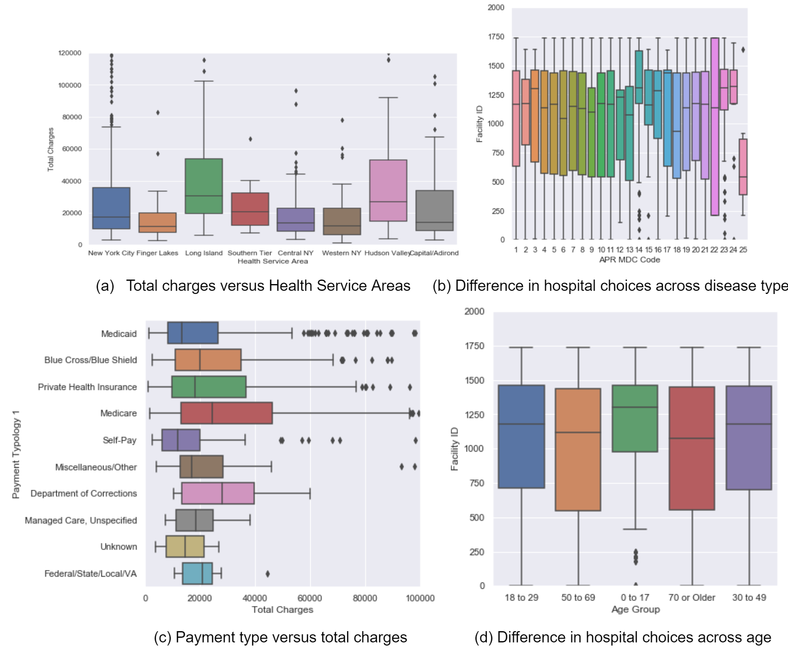

# ORIE 4741 Final Report
#### Anusha Avyukt (aa2686), Fei Xia (fx43), Siyang Liu (sl2687).
### Problem Statement
When seeking medical treatment, there are constraints posed by the type of disease, emergency level, location of the patient, health insurance and other patient characteristics like income, age etc, to visit certain hospitals. The purpose of the analysis is to help the patient select a hospital based on their medical condition and personal information. Our project considers factors critical to hospital selection in emergency situations of septicemia, mood disorders and congestive heart failure, as these are the most prevalent diseases in our dataset. It would be ideal to have a model which can help in hospital selection for any disease but apart from prediction, we also want to understand the factors which increase expenses in the emergency situation. For this purpose, we narrow the scope of the study to three diseases to analyze the difference in features which contribute to hospital charges for the treatment. 

Given a patient’s personal information, hospital indicators, demographic indicators, location, we want to give an estimate of total average charges by a hospital, for each of the diseases in the scope of our study. We also study the difference in hospital charges for mood disorders based on the protected attribute of age and gender, to find if there is any discrimation between charges for the age group and any disparate treatment of males and females for the treatment of mood disorders. We discuss the potential of our model as a weapon of math destruction. 

## Dataset
### Data Description
The main dataset we are using in this analysis, is the Statewide Planning and Research Cooperative System (SPARCS) inpatient de-Identified dataset, which provides details on patient characteristics, diagnoses, treatments, services, and charges for the year 2012. After the exploratory data analysis in the mid term report, we have augmented the dataset to include data on Inpatient Quality Indicators (IQI) , Patient Safety Indicators (PSI), Hospital Inpatient Potentially Preventable Readmission (PPR) Rates  and US Census Small Area Income & Poverty Estimates (SAIPE) 2012 for NY counties. 

The dataset provides information on service area, age group/gender/race/ethnicity of patients, type of admission, diagnosis, risk of mortality, zip code of hospital, and total charges/costs and an expanded feature set by looking at the number of beds available, insurance coverage of the patient, income and economic information at the county level, to analyze how that can be factored into recommendation for hospital in an emergency situation.  

Thus, our big messy dataset has data of different types: numerical data such as length of stay, ordinal data such as severity of illness, boolean data such as Emergency Department Indicator, and categorical data such as payment type. The total number of columns in the augmented dataset after cleaning the messy data is 28. Our feature space thus considers length of stay, severity of illness along with other indicators for patient, hospital and the financial situation. 

The target variable is the total hospital charges and is the only way to evaluate the quality of care available at a hospital with the current dataset. Because of this limitation, it will be difficult to rank the hospitals which would require data on the quality of doctors, equipment, and overall care. We thus limit our analysis to prediction of hospital charges in emergency situations for the selected diseases.  

### Data Cleaning
The first step was to delete the duplicated columns where they provide the identical information, for example, the column ‘APR MDC Description’ is a detailed explanation of ‘APR MDC Code’ where APR MDC stands for All Patient Refined Major Diagnostic Category. We also dropped the birth weight column because it is not considered useful in our analysis. We deleted payment typology 2 and 3 because they have too many NaN data and their information overlapped with payment typology 1. As emergency is the most frequent type of admission, we then delete the rows where they show non-emergency types. We also dropped the rows where the abortion edit indicator shows yes as those rows correspond to entries redacted to confidentiality. 

We then transform the string values such as ‘120 +’ in Length of Stay columns to numerical 120 and apply one-hot encoding to all the categorical data variables. During analysis, we also found that there are some entries corresponding to 120 in Gender, Race, Ethnicity, Severity of Illness variables and the rows corresponding to this were also dropped. Also, there is a string ‘OOS’ in zip code which corresponds to “Out of State”. Since our data only contains information on hospitals within New York and that is also the location of our focus, we have dropped the corresponding rows for this zip code entry. For the variables which have an unknown level for a categorical variable, like for Gender, Race, Ethnicity, it has been encoded as a separate category. 

## Exploration Data Analysis
To better understand how the emergency charges are affected by the conditions of the patients and hospitals, we plotted the total charges of emergency versus health service area, counties, type of disease, payment types, medical procedures (non-surgical or surgical). Below we only show four of the plots due to the space limit of the report.	

For the given dataset, we found that most of the medical charges for emergency lie between between 8,000 - 23,000 dollars, with a mean of 16,600 dollars. In Figure (a), we showed the total charges differ in health service areas. We found Hudson Valley and Long Island have the highest mean charges. In Figure (b), we showed the differences in hospital choices across disease types, and found that there could be potential variation in expertise of hospitals that obviously attract patients with certain diseases. In Figure (c), we showed the charges across different payment types and found that self-pay produces the lowest charges. Figure (d) shows that certain hospitals attract more 0-17 age group patients, from which we may infer a more child related medical expertise. The data exploration analysis shows the features that can be considered for the modeling part.

## Feature Selection
We also explored feature selection more quantitatively using the Random Forests model. Random Forests model can naturally select the most important features for a specific regression target. Our Random Forest model returns the top 7 important factors that influence the total charges in emergency: length of stay, medical diagnosis category, medical surgery types, hospital, service area, severity of illness and hospital county. We will use these 7 features as the main feature of consideration in our future analysis.
The simple linear regression fitting all the variables has an R squared score = 0.8. The analysis would definitely benefit from adding more features which can capture the quality of the hospital and costs in emergency and avoid the problem of underfitting. With a limited number of features, we may be underfitting and need to run regularized models while including more data.  As expected, the length of stay is an important explanatory variable as seen from the graph below. 

     
We also found that the total charges can vary a lot for severity of illness, across different groups such as age, ethnicity, and gender. A more careful analysis of the role of these personal characteristics in emergency hospital visits is thus an important step in further analysis. Do these factors really matter or there are other explanations at play. 

## Model fitting and analysis 
Our initial intuition was that location will be an important criteria in selection of hospitals in emergency situations and thus zip code would be an important variable to consider. Note that the zip code data is this dataset is trimmed from 5 digits to 3 to protect patient’s privacy. Comparison of training and test errors of the model with and without zip code shows that there is minimal difference between the two and thus we select the more parsimonious model. 

Here we are presenting results for the model fitted without the zip code, for each of the diseases using Ridge regression and Random Forest Regression which gives the feature importance. 

     

Our next step will be more focused on the modeling for the total charges based on the features we selected. Since the focus is on hospital selection for emergency cases, we would look at the factors like the type of illness, insurance coverage, distance, age and personal characteristics and how they impact the cost of emergency hospital visits. Since total charges is the only way to evaluate the quality of care available at a hospital, it will be difficult to rank them on the quality of doctors, or quality of care. 

We will however we expanding the feature set by looking at the number of beds available, insurance coverage of the patient, income and economic information at the county and average household level to analyze how that can be factored into recommendation for hospital in an emergency situation.  Our feature space can then consider severity of illness along with other indicators of hospital quality.
 
Towards this end, we will be merging the current dataset with All Payer Inpatient Quality Indicators (IQI) by Hospital (SPARCS), All Payer Inpatient Quality Indicators (IQI) Composite Measures by Hospital (SPARCS), All Payer Patient Safety Indicators (PSI) Composite Measures by Hospital,Hospital Inpatient Potentially Preventable Readmission (PPR) Rates by Hospital (SPARCS), US Census Small Area Income & Poverty Estimates (SAIPE) 2012 for NY counties.

## Results

Based on the graphs and table above, length of stay is clearly the most significant factor for total charges.  Total charges are also found to be related to the median income level, the location of the hospital, the severity of illness, at risk admission, the drug being used and the facility ID (the quality indicators of the hospitals). Notably, consider the features selected by Random forest and Ridge regression for the cases of congestive heart failure. Apart from length of stay which is common in between both the models, Random forest model picks on more indicators related to diseases and financial information which can be interpreted as patient information predicting the total charges whereas the Ridge regression is selecting dummies for hospitals, which implies that certain hospitals are more expensive controlling for patient characteristics. Both the models find the Facility_ID 3058 to be important, and that corresponds to the hospital 

Within the top 3 most prevalent diseases, we found congestive heart failure gives the best linear fit between the length of stay and total charges with train/test mean squared error (mse) to be 0.0799/0.0810. Demographic data was also found to have predictive information for total charges i.e. median income level, poverty estimates, all ages and  the location of the hospital were found to have significant coefficients. 

## Fairness Metrics 

It is crucial to consider fairness of the algorithm we use for classification as the differences for protected attributes can change the health outcomes for certain populations. If the hospital charges more from certain groups, then the lack of parity will change the data distribution in the future and make that disease more problematic for certain groups, affecting the quality of life. From the hospital regulation perspective, fairness implies that expenses for treating any disease must be the same, regardless of the age group, adjusting the for the base rate or differences between the groups. In the context of our study, statistical parity makes sense to check for disparate treatment of groups. 

We look at the data for mood disorder and classify hospital charges as more or less than $40000 using Random forest classifier for two protected attributes, age and gender. Disparate treatment, i.e. treatment must not explicitly depend on the group. This fairness metric shows that the average charges for old people, above the age of 70 is much larger than other groups while there is no difference in the average charges for males vs females. As mood disorder can call for more treatment and care for older patients compared to younger patients, this metric is capturing the differential charges. We can conclude whether the classifier is fair or not, based only on the values of this metric after accounting for the base rate differences in treatment for age groups. For the attribute sex, this classifier is fair in terms of statistical parity i.e. there is no difference between males and females, for hospital cost of  treating mood disorder.  

## Weapons of Math Destruction? 
Our model predictions and selection of hospitals to visit, can produce a weapon of math destruction, in both positive and negative directions. If certain hospitals are deemed to be more expensive for treatment, it could reduce the number of patients visiting that hospital, thus driving up the expenses of that hospital, making it even more expensive, and in some cases, driving the hospital out of business. If certain less known hospitals are recommended, then it can be a self fulfilling prophecy by bringing more patients and improving the scale of operations and medical expertise for that disease or if this selection was a false positive, the patient visiting that treatment may not get adequate care and treatment, which will affect quality of life of patients visiting that hospital. Either ways, the model predictions have altered the data distribution and can affect the metrics by which hospitals are evaluated, thus changing the allocation of resources within a hospital with consequences for patients relying on quality care at affordable prices. 

## Conclusions

## Limitations and Further work
Although we have a large dataset, we did not have variables to measure the quality of care or variables to explain the hospital charges and thus give a ranking of hospitals. An ordinal regression to rank the hospitals would be informative in recommendations. An unsupervised learning algorithm could also be used to cluster the hospitals based on their specialities and the patient characteristics. What we care about the most in life threatening situations is the timeliness and quality of care, which cannot be adequately captured by the hospital charges. Measures to capture the quality of care would thus help build a better predictive system and from a broader perspective, in choosing the location and medical expertise based on the requirements of the demographic population. 

For including the zip codes, instead of one hot encoding, we wanted to include the additional census information and fit a generalized low rank model that condenses the information into a small vector. In future work, we would like to explore more spatial variables for assessing hospital charges and quality of care. 

## References
