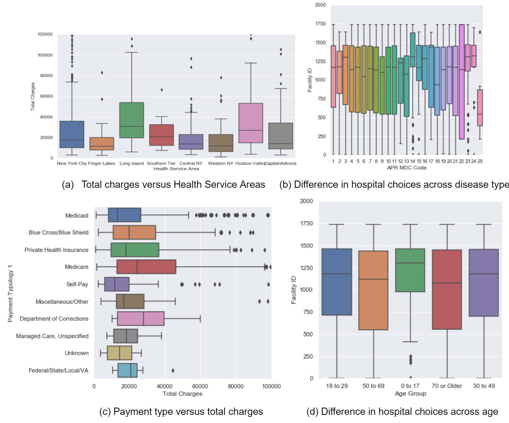
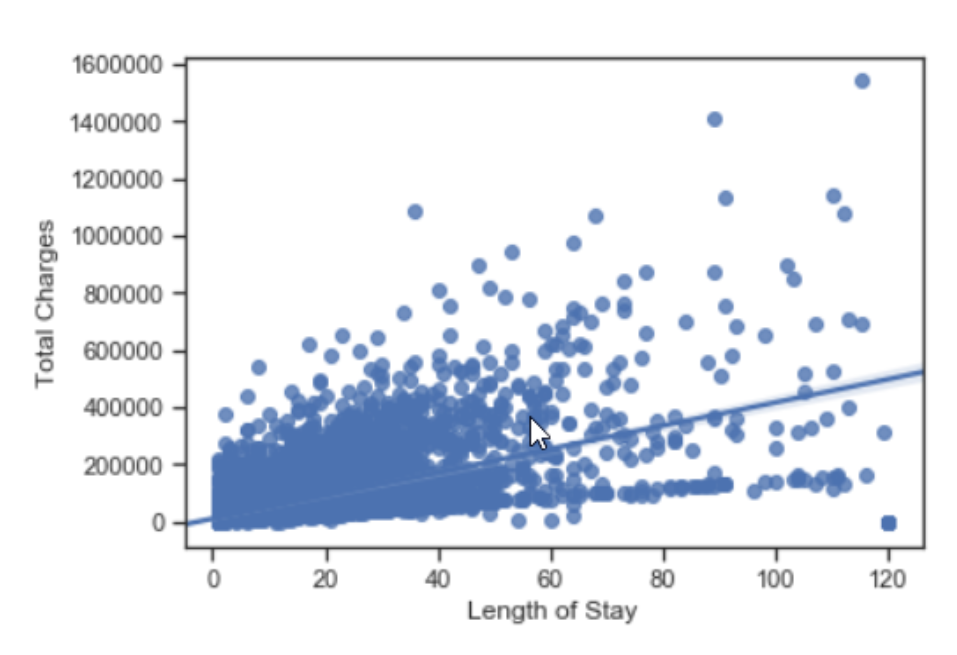
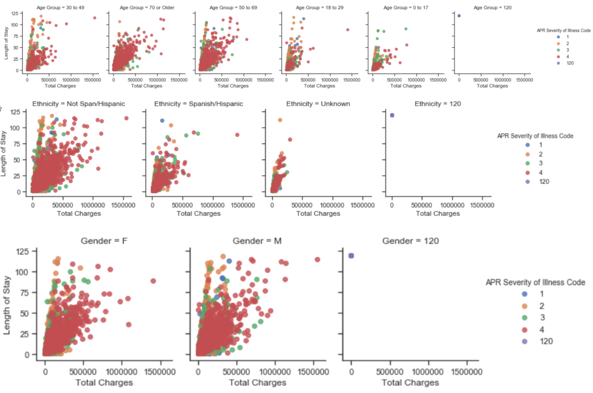

# ORIE 4741 Midterm Report
#### Anusha Avyukt (aa2686), Fei Xia (fx43), Siyang Liu (sl2687)
### 1. Problem Statement
When seeking medical treatment, there are constraints posed by health insurance provider to visit certain hospitals covered by the insurance policy. Our project focuses on hospital selection for emergency cases, based on patients’ medical conditions and other relevant features.

Given a patient’s personal information, illness and location, we want to give an estimate of total average charges. We hope to develop a strategy to find a best fit of a hospital that meets the patient’s requirements and categorize hospitals based on specialty in specific diseases and location. 

## 2.Dataset
### 2.1 Data Description
The main dataset we are using in this analysis, is the Statewide Planning and Research Cooperative System (SPARCS) inpatient de-Identified dataset, which provides details on patient characteristics, diagnoses, treatments, services, and charges for the year 2012. As of now, there are 2.54 million rows and 34 columns entries in the raw dataset. 
### 2.2 Data Cleaning
Specifically, the dataset provides information on service area, age group/gender/race/ethnicity of patients, type of admission, diagnosis, risk of morality, zip code of hospital, and total charges/costs. There are different types of data including: numerical data such as length of stay,  ordinal data such as severity of illness, boolean data such as Emergency Department Indicator, and categorical data such as payment type. 

To clean the dataset, we first deleted the duplicated columns where they provide the identical information, for example, the column ‘APR MDC Description’ is a detailed explanation of ‘APR MDC Code’ where APR MDC stands for All Patient Refined Major Diagnostic Category. We also dropped the birth weight column because it is not considered useful in our analysis. We deleted payment typology 2 and 3 because they have too many NaN data and their information overlapped with payment typology 1. As emergency is the most frequent type of admission, we then delete the rows where they show non-emergency types.  We also dropped the rows where the abortion edit indicator shows yes as those rows correspond to entries redacted due for confidentiality. We then transform the string values such as ‘120 +’ in Length of Stay columns to numerical 120 and performed one-hot encoding to all the categorical data. During analysis, we also found that there are some entries corresponding to 120 in Gender, Race, Ethnicity variables and we would need to drop these rows from the analysis. Also, there is a string ‘OOS’ in zip code which corresponds to “Out of State”. We will choose whether this variable encoding matters in the final model or it there is any specific out of state effect that can be captured. Otherwise, we can drop the out of state zipcodes to consider only hospitals in NY. 

In further analysis, we also want to find out whether the Gender, Race, Ethnicity should include the category of unknown or to drop the rows where this information is not available. This will depend on whether these personal characteristics and the way they are encoded actually have an effect in the final analysis.

## 3. Data Exploration Analysis
To better understand how the emergency charges are affected by the conditions of the patients and hospitals, we plotted the total charges of emergency versus health service area, counties, type of disease, payment types, medical procedures (non-surgical or surgical). Below we only show four of the plots due to the space limit of the repot. According to the given dataset, we found that most of the medical charges for emergency lie between 0 - 20,000 dollars, with a mean of 18,800 dollars. In Figure (a), we showed the total charges difference across difference health service areas. We found Hudson Valley and Long Island has the highest mean charges. In Figure (b), we showed the differences in hospital choices across disease types, and found that there could be potential expertise difference of the hospitals that obviously attract patients with certain diseases. In Figure (c), we showed the charges across different payment type and found that self-pay produces the lowest charges. In Figure (d), we showed that certain hospitals attracts more 0-17 age group patients meaning more children related expertise. The data exploration analysis helped us determined intuitively the features that can be considered for the modeling part.

## 4. Feature Selection
We also explored feature selection more quantitatively using Random Forests model. Random Forests model can naturally select the most important features for a specific regression target. Here, we found the top 7 important factors that influence the total charges in emergency, which are length of stay, medical diagnosis category, medical surgery types, hospital, service area, severity of illness and hospital county. We will use these 7 features as the main feature of consideration in our future analysis. 

The simple linear regression fitting all the variables has adjusted R squared score = 0.8. 
The analysis would definitely benefit from adding more features which can capture quality of the hospital and costs in emergency and avoid the problem of underfitting. With a limited number of features, we may be underfitting and need to run regularized models while including more data.  As expected, the length of stay is an important explanatory variable as seen from the graph below. 

     
We also found that the total charges can vary a lot for severity of illness, across different groups such as age, ethnicity, and gender. A more careful analysis of the role of these personal characteristics in emergency hospital visits is thus an important step in further analysis. Do these factors really matter or there are other explanations at play. 

## 5. Future Work
Our next step will be more focused on the modeling for the total charges based on the features we selected. Since the focus is on hospital selection for emergency cases, we would look at the factors like the type of illness, insurance coverage, distance, age and personal characteristics and how they impact the cost of emergency hospital visits. Since total charges is the only way to evaluate the quality of care available at a hospital, it will be difficult to rank them on the quality of doctors, or quality of care. 

We will however we expanding the feature set by looking at the number of beds available, insurance coverage of the patient, income and economic information at the county and average household level to analyze how that can be factored into recommendation for hospital in an emergency situation.  Our feature space can then consider severity of illness along with other indicators of hospital quality.
 
Towards this end, we will be merging the current dataset with 

All Payer Inpatient Quality Indicators (IQI) by Hospital (SPARCS)
All Payer Inpatient Quality Indicators (IQI) Composite Measures by Hospital (SPARCS):
All Payer Patient Safety Indicators (PSI) Composite Measures by Hospital
Hospital Inpatient Potentially Preventable Readmission (PPR) Rates by Hospital (SPARCS)
US Census Small Area Income & Poverty Estimates (SAIPE) 2012 for NY counties

